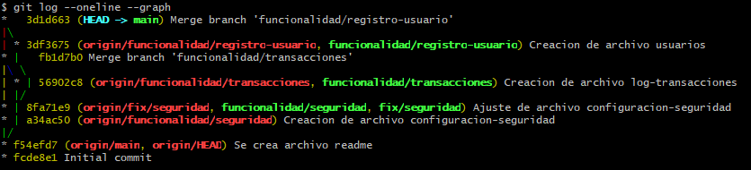
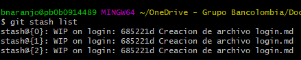
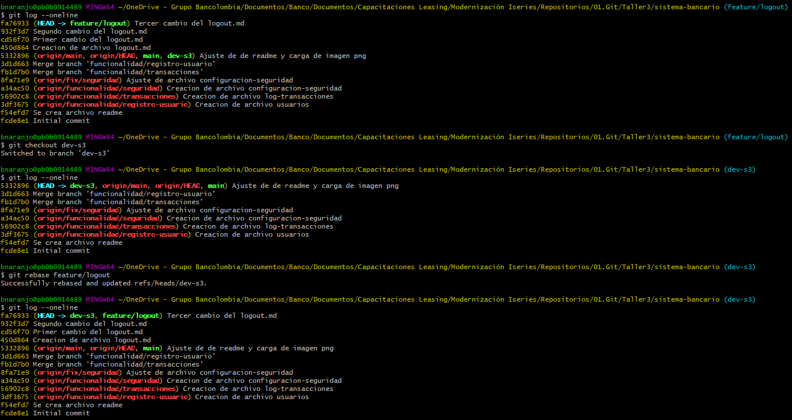
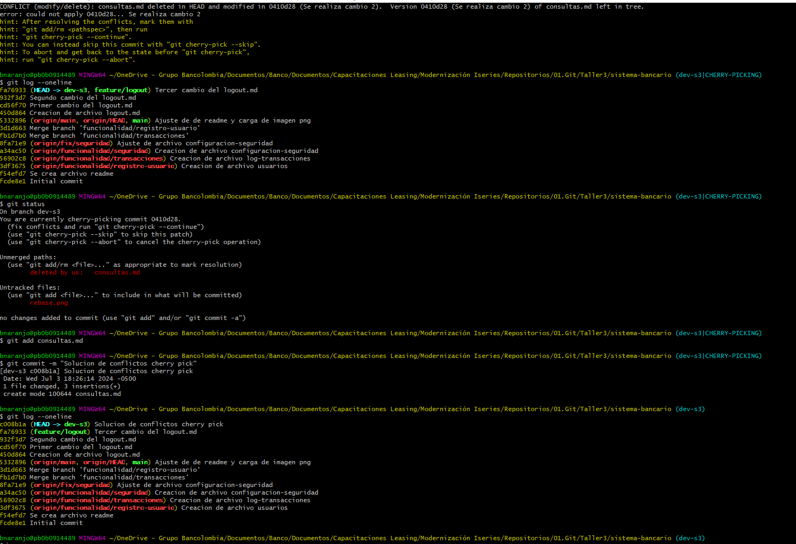

# Sistema Bancario Moderno

  

## Descripción

  

El Sistema Bancario Moderno es una aplicación avanzada diseñada para gestionar las operaciones y servicios de una entidad financiera. Esta solución proporciona una plataforma segura, eficiente y fácil de usar para manejar cuentas bancarias, transacciones, préstamos y más.

  

## Características

  

-  **Gestión de Cuentas**: Creación y administración de cuentas corrientes, de ahorro y cuentas empresariales.

-  **Transacciones**: Transferencias internas y externas, pagos de facturas, depósitos y retiros.

-  **Préstamos**: Solicitud, aprobación y seguimiento de préstamos personales, hipotecarios y empresariales.

-  **Seguridad**: Autenticación de dos factores, cifrado de datos y monitoreo de actividades sospechosas.

-  **Interfaz de Usuario**: Interfaz intuitiva y adaptable para diferentes dispositivos (escritorio y móvil).

-  **Soporte al Cliente**: Sistema de tickets para resolver dudas y problemas de los usuarios.

  

## Requisitos del Sistema

  

-  **Servidor**: Linux, Windows o macOS.

-  **Base de Datos**: MySQL, PostgreSQL o cualquier otro sistema de gestión de bases de datos relacional.

-  **Backend**: Node.js, Python (Django/Flask) o Java (Spring Boot).

-  **Frontend**: React, Angular o Vue.js.

-  **Otros**: Docker para contenedorización, Git para control de versiones.

  

## Instalación

  

### Clonar el Repositorio

  

`git clone https://github.com/usuario/sistema-bancario-moderno.git

cd sistema-bancario-moderno`

  

### Configuración del Backend

  

1. Navegar al directorio del backend:

`cd backend`

2. Instalar las dependencias:

`npm install # Para Node.js

pip install -r requirements.txt # Para Python`

3. Configurar la base de datos:

Crear un archivo `.env` con la configuración de la base de datos:

`DB_HOST=localhost

DB_USER=usuario

DB_PASS=contraseña

DB_NAME=sistema_bancario`

4. Ejecutar migraciones de la base de datos:

`npx sequelize db:migrate # Para Node.js con Sequelize

python manage.py migrate # Para Django`

5. Iniciar el servidor:

`npm start # Para Node.js

python manage.py runserver # Para Django`

  

### Configuración del Frontend

  

1. Navegar al directorio del frontend:

  

`cd frontend`

2. Instalar las dependencias:

`npm install`

3. Configurar la URL del backend en un archivo de configuración:

javascript

  

`const config = {

apiUrl: 'http://localhost:3000/api'

};`

4. Iniciar la aplicación:

`npm start`

  

## Uso

  

1. Registrarse como un nuevo usuario o iniciar sesión con una cuenta existente.

2. Navegar a través del tablero para ver el resumen de las cuentas.

3. Realizar transacciones como transferencias y pagos.

4. Solicitar y gestionar préstamos.

5. Acceder a la configuración de seguridad para habilitar autenticación de dos factores.

  

## Contribución

  

1. Hacer un fork del proyecto.

2. Crear una rama para tu funcionalidad (`git checkout -b feature/nueva-funcionalidad`).

3. Commit tus cambios (`git commit -am 'Añadir nueva funcionalidad'`).

4. Push a la rama (`git push origin feature/nueva-funcionalidad`).

5. Crear un Pull Request.

## Logs

Logs  

## stash

stash  

## rebase

rebase  

## cherry-pick

cherry-pick  

## Licencia

  

Este proyecto está bajo la Licencia MIT. Para más detalles, ver el archivo LICENSE.

  

## Contacto

  

Para cualquier consulta o sugerencia, por favor contactar a correo@ejemplo.com.

  

----------

  

¡Gracias por contribuir al Sistema Bancario Moderno!